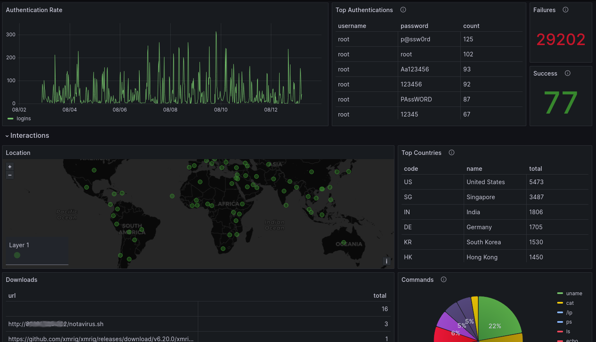

<div align='center'>
    <h1><b>Honey Tits</b></h1>
    
    <p><b>A brief introduction to a honey pot with grafana dashboards.</b></p>


</div>

---
## &#10067; **ABOUT**

A quick way to learn a little about cyber security is by watching what hackers (or wanna be hackers) are doing.  Honey pots are the perfect tool for the mission.  This project is designed to help beginners get started with honeypots and to observe hackers in action.

Whats included in the box?

- A MySQL database to store and manage data
- Cowrie Honey pot (https://github.com/cowrie/cowrie)
- Grafana visualization
- Geographical location of authentication attempts
<br />

---
## Project structure
```
HoneyTits
 ├── .env        (configurable docker environment variables)
 ├── cowrie.cfg  (configuration options for the cowrie honeypot)
 ├── docker-compose.yml 
 ├── README.md
 ├── userdb.txt  (allowed users accounts)
 └── setup       (one-time initializations)
     ├── grafana     (dashboards and visualizations)
     └── sql         (database schemas)
```
<br />

---
## &#128466;&#65039; **Instructions**

### Quick Start:

*It is recommended that your never use your personal computer. If you need a cheap Linux server to host this honeypot, use [Linode](https://www.linode.com).  Instructions for getting started with Linode are in "[Obtain a VPS at Linode](#Obtain-a-VPS-at-Linode)" section below.*

1. Clone this repo.
   ```
   git clone https://github.com/Digital-Static/HoneyTits.git
   cd HoneyTits
   ```

2. Edit the `.env` file.<br>Edit the two password variables.  Be sure to choose secure passwords... especially if the honeypot will be exposed to the open internet.
   ```
   vi .env
   ```

3. Edit the `userdb.txt` file.<br>Here you insert the username/password combinations that will actually authenticate successfully.  You do not want to make these passwords too difficult because no hackers will get in.  On the other hand, if they are too easy then hackers will suspect this is a honeypot.<br>Start with the defaults and after running the honeypot for a few days... view the data and choose the username/password combinations that have moderate attempts. 
   ```
   vi userdb.txt
   ```

4. Start everything up.<br>To start it, enter the following command.
   ```
   docker compose up -d
   ```
   It may take a few minutes to get started as the database is being prepared.
<br />

### Usage:

1. Visualize the activity against the honey pot.<br>Open a browser and go to [http://YOUR_IP:3000/d/d41459b6-4a8b-4855-9475-ae0c7fb9dfce/overview](http://YOUR_IP:3000/d/d41459b6-4a8b-4855-9475-ae0c7fb9dfce/overview).  You will be required to log into the Grafana instance.  Use `admin` for the user and the password.  Upon logging in for the first time, you will be required to change the password.  Choose a secure password as this service will be open to the internet.

2. Browse the data.<br>Open a browser and go to [http://YOUR_IP:8080/?server=db&db=cowrie](http://YOUR_IP:8080/?server=db&db=cowrie).  Use the database credentials that you choose in the `.env` file to login.
<br />

---
## 🔎 **SHOWCASE**


<br />

---
## &#128187; **Server Preparation**

### [Obtain a VPS at Linode](https://www.linode.com/):
Linode offers many different servers at different price points.  Luckily, this honeypot does not require many resources so the cheapest servers will do.
I recommend the shared CPU plan named "Nanode 1GB". Currently it cost $5 a month.  Use "Rocky 8" for the image.

Once you have the server running, remember the IP address as it will be needed in the steps below.  Port 9876 is chosen as the custom ssh port, but you can choose any port.  Just replace 9876 with the port of your choice.<br>
Complete the following steps.

1. Login to the server on the standard ssh port.
   ```
   ssh root@YOUR_IP
   ```

2. Install docker.
   ```
   dnf -y install yum-utils
   yum-config-manager --add-repo https://download.docker.com/linux/centos/docker-ce.repo
   dnf -y update
   dnf -y install docker-ce docker-ce-cli containerd.io
   systemctl enable --now docker
   systemctl start docker
   ```

3. Install git.
   ```
   dnf -y install git
   ```

4. Change the SSH service port to 9876
   ```
   sed -i -e "/Port /c\Port 9876" /etc/ssh/sshd_config
   ```

5. Now, add the custom SSH port to the firewall.
   ```
   firewall-cmd --zone=public --add-port=9876/tcp --permanent
   firewall-cmd --reload
   ```

6. When running a service on a custom port, you must change the configuration file for the service (Step 1) and also add a SELinux port definition. Without the port definition, the service cannot bind to the custom port.
   ``` 
   yum install -y policycoreutils-python-utils
   semanage port -a -t ssh_port_t -p tcp 9876
   semanage port -m -t ssh_port_t -p tcp 9876
   systemctl restart sshd
   reboot
   ```

From now on, to login you must use port 9876, like this `ssh -p 9876 root@YOUR_IP`.  The standard port 22 will now be used by the honeypot.
<br />

---

## 📎 **LICENSE**

### [**GNU LESSER GENERAL PUBLIC LICENSE v3**](https://www.gnu.org/licenses/lgpl-3.0.en.html)
